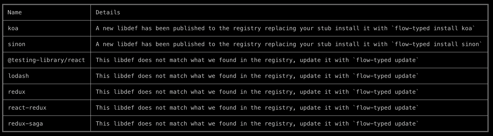

# outdated

Updates the global local cache and prints a table of all outdated currently installed definitions in the ./flow-typed directory.



### Examples

```
flow-typed outdated
```

### Flags

|Shorthand|Longhand|Description|Type|
|---------|--------|-----------|----|
|-f|--flowVersion|The Flow version that outdated libdefs must be compatible with|string|
|-l|--libdefDir|Scan currently installed libdefs from a custom directory (instead of the default, `./flow-typed`)|string|
|-p|--packageDir|The relative path of package.json where flow-bin is installed|string|
|-r|--rootDir|Directory of .flowconfig relative to node_modules|string|
|-u|--useCacheUntil|Use cache until specified time in milliseconds|number|
